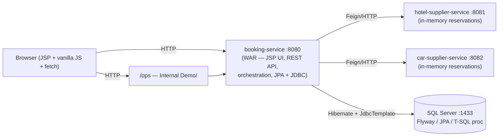
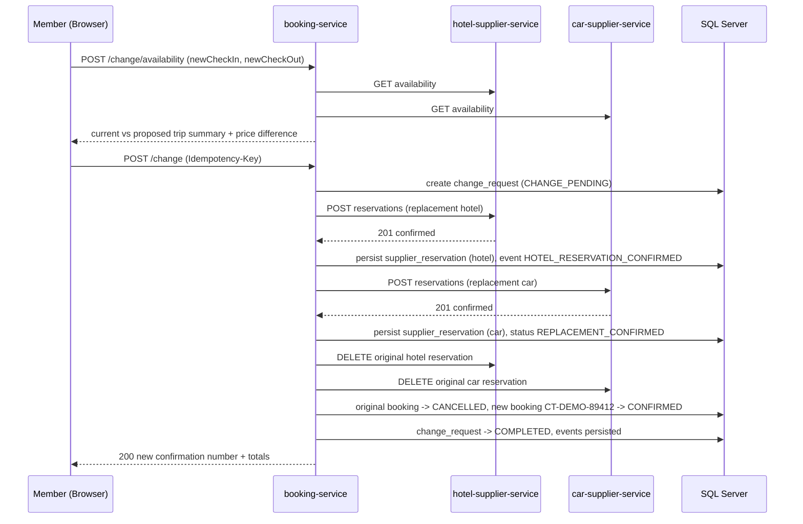
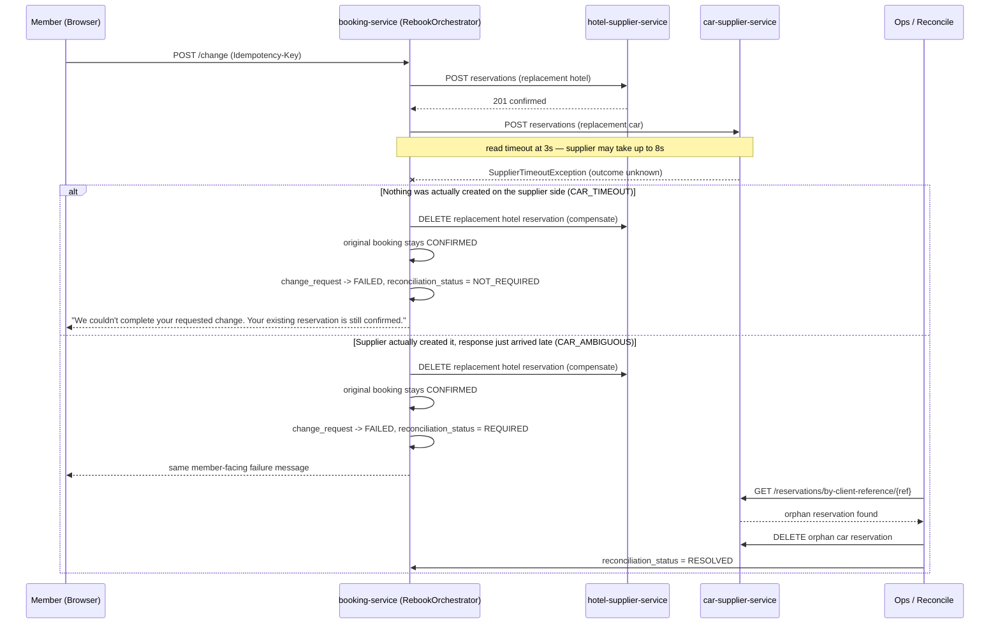

# Costco Travel Smart Rebook

A resilient, self-service reservation-change prototype exploring what happens when a "replace this
hotel/car booking" operation has to talk to two independent supplier systems and one of them fails —
or worse, times out without telling you whether it actually succeeded.

> Independent engineering prototype created for interview discussion. Not affiliated with Costco
> Wholesale or Costco Travel. All member, booking, and supplier data below is synthetic.

## Why I Built This

I was curious about a public product workflow. The Costco Travel site lets a member change some hotel
and rental car bookings, and for certain changes the flow is a conservative two-step process: confirm a
replacement, then cancel the original. That's a sound design choice, not a flaw — cancelling only after
a replacement is secured protects the member.

That two-step pattern is genuinely interesting from a distributed-systems angle: could part of it be
safely orchestrated into a single self-service change, while still protecting the existing reservation
if the replacement process partially fails? I don't know Costco Travel's actual backend architecture,
supplier contracts, or internal constraints — this project is one possible design based on observing the
public product, built as a vehicle to work through a real reliability problem: coordinating a
multi-supplier transaction that can't rely on a single database transaction to keep it consistent.

## Problem Statement

A member wants to change the dates on an existing hotel + car booking. The replacement requires two
independent HTTP calls to two independent supplier systems (hotel, car). Either call can fail outright,
fail ambiguously (timeout with unknown supplier-side outcome), or succeed. The system must never leave
the member's original, working reservation in a broken state because of a failure in the replacement
process.

## Core Invariant

> A reservation-change operation must not knowingly leave the member without their original valid
> reservation because a replacement transaction partially failed.

The replacement is secured **before** the original booking's final state changes. The original booking is
only cancelled after both the replacement hotel and replacement car reservations are confirmed.

## Architecture



Maven multi-module reactor: `shared-contracts` (jar — supplier DTO records), `hotel-supplier-service`
(jar, :8081), `car-supplier-service` (jar, :8082), `booking-service` (war, :8080 — JSP UI + REST API +
orchestration + persistence, packaged as a WAR because Spring Boot cannot serve JSPs from an executable
fat JAR; it still runs with `java -jar`).

## Happy Path



## Failure: Partial / Ambiguous Supplier Outcome (the centerpiece)

The single most important design decision in this project, verified by hand: a car-reservation-call
timeout (the client gives up after 3s; the supplier may still respond up to 8s later) is
**indistinguishable at the HTTP client level** from "the supplier never created anything." Both surface
as the same `SupplierTimeoutException`. The orchestrator never guesses which one happened.



Either way, the member's original booking is never touched until the outcome is certain. The difference
between the two branches only matters for cleanup, and cleanup is handled after the fact by
**Reconcile**, not by guessing in the hot path.

## Idempotency

Every confirmation action (`POST /change`) requires a client-generated `Idempotency-Key` header. The
server stores the key, a SHA-256 hash of the request body, the operation, status, and final response in
`idempotency_records`. Same key + same body hash → the stored final response is replayed with zero
supplier calls. Same key + a different body hash → `409 IDEMPOTENCY_KEY_CONFLICT`.

One real bug surfaced and fixed during build: a duplicate request arriving *after* the original booking
had already transitioned to `CANCELLED` was, for a while, incorrectly re-validated against the booking's
*current* state (now invalid, since the original is gone) instead of being replayed. The fix was to check
for an idempotency replay **before** any booking-state validation runs, not after.

## Transaction Boundaries

A relational transaction protects local state — the row for one booking, one change request, one event —
but it **cannot atomically roll back independent external supplier systems**. If the hotel supplier has
already confirmed a reservation and the car call subsequently fails, no database `ROLLBACK` undoes the
hotel supplier's state. That's why compensation is explicit application logic (an HTTP `DELETE` to the
hotel supplier), not a transaction rollback, and why the codebase describes this as **"application-level
orchestration with compensating actions inspired by the Saga pattern"** rather than claiming a real Saga
framework.

## Data Model

Tables: `members` · `bookings` (has `version` for JPA `@Version` optimistic locking) · `booking_items` ·
`change_requests` (has both a `status` **and** a separate `reconciliation_status` column — these are two
independent axes: whether the change request itself finished, and whether a post-hoc reconciliation is
needed) · `supplier_reservations` · `booking_events` · `idempotency_records` · `incidents`.

Indexes, each justified by a concrete query path (see migration `V2__create_indexes.sql` comments):
`booking_events (supplier, status, created_at)` for the reliability report, `booking_events
(correlation_id)` for the transaction-timeline lookup, `bookings (confirmation_number)` unique for the
primary member lookup, `idempotency_records (idempotency_key)` unique — the correctness guarantee itself
— and `change_requests (booking_id, status)` for the in-progress-change guard.

## SQL / Hibernate / JDBC Decisions

**Hibernate/JPA** is used for all writes — booking, change request, and event entities, with `@Version`
optimistic locking on `Booking` to reject a second concurrent change with a `409`.

**JDBC** (`SupplierReliabilityJdbcRepository`, `JdbcTemplate`) is used specifically for the Ops supplier
reliability report, which calls a hand-written T-SQL stored procedure, `sp_supplier_reliability_report`.
JPA/Hibernate is a poor fit for a report whose whole point is a database-native windowed percentile
calculation across arbitrary historical rows — JDBC against a stored procedure is the more honest tool
for that job, and it's a concrete, defensible answer to "when would you use JDBC instead of Hibernate?"

Three real gotchas hit and fixed during build:
- **`DATETIMEOFFSET(6)`, not `DATETIME2`, for every timestamp column.** Hibernate 6 maps
  `java.time.Instant` to `datetimeoffset` by default on the SQL Server dialect; using `DATETIME2` in the
  schema caused a type mismatch against the entity mapping.
- **`response_body` in `idempotency_records` is `VARCHAR(MAX)`, not `NVARCHAR(MAX)`.** Hibernate's
  `@Lob String` maps to a CLOB, and SQL Server's dialect expects that as `varchar(max)`, not the
  Unicode variant.
- **`PERCENTILE_CONT` is a window function, not a `GROUP BY` aggregate** in T-SQL. It has to be computed
  per-row via `PERCENTILE_CONT(0.95) WITHIN GROUP (ORDER BY ...) OVER (PARTITION BY supplier)` inside a
  CTE, then collapsed with `MAX`/`GROUP BY` in the outer query — writing it as a naive aggregate simply
  does not compile.

## Observability

Structured JSON logging via `logstash-logback-encoder`, with the correlation ID (`CHG-XXXXXXXX`, one per
change request) carried in MDC on every log line, alongside a `service` field identifying which of the
three Spring Boot services emitted it. An optional `SplunkHecAppender` forwards logs to a Splunk HTTP
Event Collector — but only if `SPLUNK_HEC_URL`/`SPLUNK_HEC_TOKEN` are set. No paid Splunk account is
needed to run or demo this project; the appender is completely inert by default.

Each service exposes `/actuator/health`, and the compose SQL Server has its own healthcheck.

## CI/CD

The root `Jenkinsfile` runs: Checkout → Build (`./mvnw -B clean compile`) → Unit Test (`./mvnw -B test`,
published via `junit`) → Integration Test (gated behind `RUN_INTEGRATION_TESTS`, since those tests need a
live SQL Server) → Package (`./mvnw -B package -DskipTests`) → a lightweight Quality/Verification stage →
Archive Artifacts → a clearly non-production Deploy placeholder stage. No invented internal
infrastructure — generic environment variables throughout.

## Testing

JUnit 5 + Mockito + Spring Boot Test cover the orchestration and compensation logic directly: successful
replacement, hotel reservation failure, car timeout + compensation, the original booking staying
`CONFIRMED` when a replacement fails, idempotent duplicate handling, same-key-different-body conflict,
ambiguous timeout → `RECONCILIATION_REQUIRED`, the reconciliation flow itself, an invalid original
booking, concurrent-change conflict, price comparison math, and supplier error mapping. Integration tests
tagged `@Tag("integration")` run against a real SQL Server under a `test` profile and are bound to
failsafe so `./mvnw test` stays fast.

## Tradeoffs

- **The Feign timeout gotcha.** The YAML property `feign.client.config.default.readTimeout` was tried
  first and silently did not take effect. The fix was an explicit `feign.Request.Options` `@Bean` (2s
  connect / 3s read), which is authoritative — worth knowing if you ever see a Feign timeout config that
  looks correct but isn't being honored.
- **The seeded original booking has no real supplier reservation behind it to cancel.** `CT-DEMO-78291`'s
  hotel/car confirmations (`HTL-DEMO0001`, `CAR-DEMO0001`) are seed data, not reservations the supplier
  services actually created at startup — so a cancellation call against those specific IDs during a real
  run would be against IDs the supplier doesn't recognize. This is a demo-data limitation, not a gap in
  the compensation logic itself, which is otherwise exercised end-to-end against reservations the
  suppliers really did create during that run.
- **Taxes & fees are a lookup table, not a tax engine.** The pricing difference shown to the member
  ($1,820 hotel + $370 car + $220 taxes = $2,410, a $70 delta from the original $2,340) is deterministic
  demo pricing, not a real tax/fee calculation engine.
- **`shared-contracts` creates a build-time coupling** between all three services and the DTO module.
  That's an accepted tradeoff for a project this size — a real system might version supplier contracts
  independently instead.

## Assumptions

- Authentication is out of scope; `DemoMemberContext` always resolves to the one seeded member
  (`DEMO-EXEC-001`, Sainath Gandhe, Executive Member). No login page, no credential form.
- No payment flow exists anywhere in the system — no card number is ever collected or stored.
- One booking, one member, one demo scenario at a time; this is not a multi-tenant system.

## What Is Mocked

The hotel supplier, the car supplier (both are real, independently running Spring Boot HTTP services,
but their data is in-memory and their business logic is a deterministic simulation, not real inventory),
ServiceNow (a `MockServiceNowIncidentClient` generates sequential `INC-DEMO-####` references), payments,
and authentication.

## What Is Real

All three Spring Boot services communicating over actual HTTP via Feign; SQL Server persistence via
Hibernate/JPA; a hand-written JDBC repository calling a real T-SQL stored procedure with
`PERCENTILE_CONT`; the idempotency mechanism; the orchestration/compensation/reconciliation state
machine; Resilience4j circuit breakers (`hotelSupplier`/`carSupplier`) and bounded retry on availability
calls only; structured JSON logs with correlation IDs; and a JUnit test suite covering all of the above.

## How to Run

```bash
cp .env.example .env          # dev-only SA password — never commit .env
docker compose up -d          # SQL Server (Docker Desktop must be running)

# SQL Server only auto-creates the "master" database — the app database must be created once:
MSYS_NO_PATHCONV=1 docker exec smartrebook-sqlserver /opt/mssql-tools18/bin/sqlcmd -C -S localhost -U sa -P "DevOnly_P@ssw0rd123" \
  -Q "IF DB_ID('smartrebook') IS NULL CREATE DATABASE smartrebook;"

./mvnw clean verify           # build + unit tests
./scripts/start-demo.sh       # or scripts/start-demo.ps1 on native Windows
```

| Surface | URL |
|---|---|
| Member portal | http://localhost:8080 |
| Operations | http://localhost:8080/ops |
| Hotel / car supplier health | http://localhost:8081/actuator/health · http://localhost:8082/actuator/health |

Demo booking **CT-DEMO-78291**. Reset any time via Demo Controls → Reset Demo, or `POST /api/demo/reset`.

## Interview Demo

See [`docs/DEMO_SCRIPT.md`](docs/DEMO_SCRIPT.md) for the full run-of-show, and
[`docs/TALKING_POINTS.md`](docs/TALKING_POINTS.md) / [`docs/TECHNICAL_QA.md`](docs/TECHNICAL_QA.md) for
the Q&A that follows it.

## What I Would Explore With Real Domain Context

I don't know Costco Travel's actual architecture; this is one possible design based on public product
behavior. Given real domain context, I'd want to dig into: actual supplier contract capabilities
(can a real hotel/car supplier API support a temporary inventory hold instead of an immediate
book-then-cancel?), payment authorization and how a mid-flight price change should interact with a
already-authorized charge, change fees and package-level cancellation rules that a real travel product
almost certainly has and this prototype does not model, what a real support/ops workflow around a stuck
reconciliation actually looks like, real observability and SLOs instead of a demo-scale ops page, real
authentication and PCI scope, and how a genuine ServiceNow/Splunk integration would actually behave under
their production constraints rather than the mocks used here.
